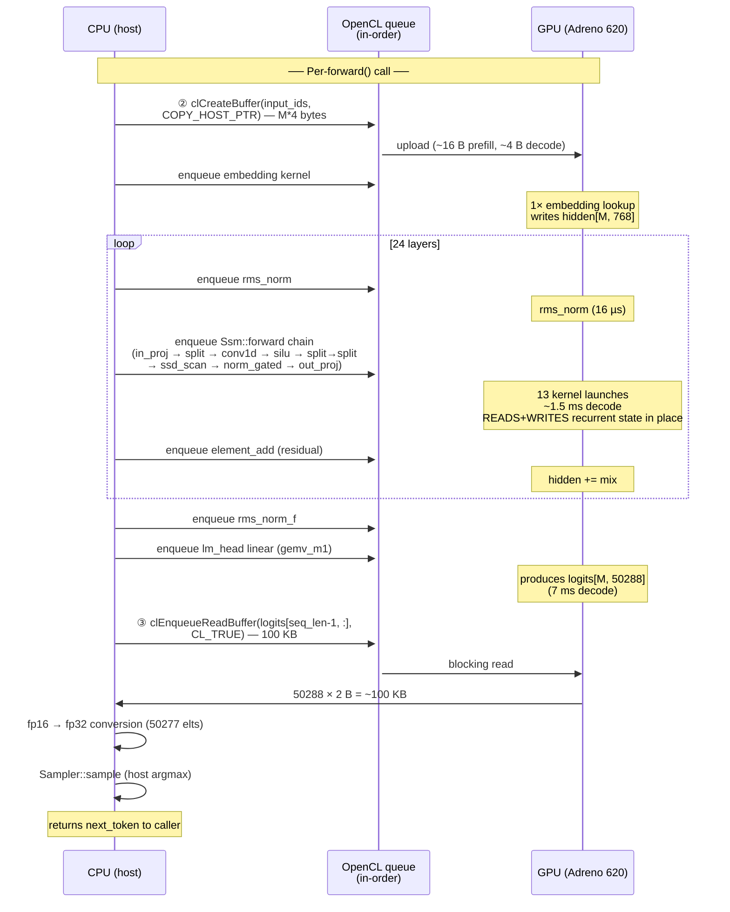

# Benchmark log — Mamba2-130M on Razr 2020 (Adreno 620, fp16)

**Mission: beat Mamba-130M-HF's final 24.56 tok/s decode on the same device.**

The Mamba1 v2 port at `adreno-llms/src/models/mamba-130m` ended Phase 2 at **24.56 tok/s** = 13.64× over its 1.80 tok/s baseline = 63% of its 38.7 tok/s roofline. This benchmark sets up the same instrumentation, baseline, and ranked plan for Mamba2.

## Benchmark protocol

**One-time setup (after any source change):**
```bash
cd <repo-root>/src/models/mamba2-130m
NNOPT_DTYPE=fp16 ./scripts/build.sh --release
NNOPT_DTYPE=fp16 ./scripts/deploy_android.sh
```
- `--release` ⇒ CMake `Release` (`-O3`) with `-DNNOPT_DEBUG=` unset (debug macros stripped).
- `NNOPT_DTYPE=fp16` builds `build/fp16/mamba2_130m_inference_fp16` and pulls `weights/model.fp16.bin`.

**Per-run command:**
```bash
NNOPT_DTYPE=fp16 NNOPT_DEBUG_LAYERS=0 ./scripts/run_android.sh \
    "Once upon a time" 32 --temperature 0 --seed 42
```
- `NNOPT_DEBUG_LAYERS=0` suppresses per-step stderr noise.
- `--temperature 0` ⇒ greedy decode (deterministic).
- `--seed 42` pinned for reproducibility (irrelevant under greedy).
- 4 prompt tokens + 32 new tokens.

**Metric:** `BENCHMARK decode_tokens_per_sec` from main.cpp, defined as `(n_generated - 1) / (total_inference_sec - time_to_first_token_sec)` — steady-state per-token cost, excludes prefill.

**Per-step ritual:** 3 consecutive runs, take **median** decode tok/s. Variance <1% on stable changes; >5% is rejected as thermal/contention.

**Token-IDs as canonical reference.** Greedy decode is deterministic. Every step run also captures the 36 generated token IDs (4 prompt + 32 generated) and verifies against the locked reference. Divergence is treated as a correctness regression.

**Profile mode:**
```bash
adb shell "cd /data/local/tmp/mamba2_130m_inference && \
  NNOPT_KERNEL_PROFILE=1 LD_LIBRARY_PATH=/data/local/tmp/mamba2_130m_inference/lib:/system/vendor/lib64 \
  ./mamba2_130m_inference_fp16 'Once upon a time' 32 --temperature 0 --seed 42"
```
- Each `clEnqueueNDRangeKernel` and CLBlast `Gemm` enqueue captures a `cl_event` (queue is created with `CL_QUEUE_PROFILING_ENABLE` in `opencl_context.cpp:41`). After `model.generate()` finishes, `KernelProfiler::dump_summary()` reads `CL_PROFILING_COMMAND_START`/`END` from each event and prints a per-label aggregate sorted by total GPU time descending. Implementation: `src/kernel_profiler.{h,cpp}`.
- **CAVEAT.** CLBlast's `Gemm` only attaches the event to its LAST internal sub-kernel (CLBlast often decomposes Gemm into transposeA + kernelMain + epilogue). The reported `linear_*` times are LOWER BOUNDS — true CLBlast wall time is higher. Native single-kernel sites (rms_norm_gated, ssd_scan, etc.) are reported accurately.
- Per-event overhead (`clGetEventProfilingInfo` blocks) ≈10-30 µs of host work; never quote tok/s from a profile run.

## Hardware ceiling

**Snapdragon 765G / Adreno 620 / LPDDR4X-2133 dual-channel**

- Peak DRAM bandwidth: 17.0 GB/s (4266 MT/s × 16 bits × 2 channels / 8). Marketing.
- Realistic GPU-visible bandwidth: ~10 GB/s (mamba1 v2 confirmed empirically; SmolLM2 same).
- Adreno 620 fp16 ALU: ~2.32 TFLOPS — irrelevant; mobile LLM decode is BW-bound.

**Mamba2-130M weight footprint at fp16:**

| Component | Per-layer | × 24 layers | Per token (decode) |
|---|---|---|---|
| in_proj (768 → 3352) | 4.91 MB | 117.9 MB | 117.9 MB |
| out_proj (1536 → 768) | 2.25 MB | 54.0 MB | 54.0 MB |
| conv1d (k=4) + bias + A + D + norm + dt_bias | ~22 KB | 0.53 MB | 0.53 MB |
| **Per-layer subtotal** | **~7.18 MB** | **~172.4 MB** | — |
| backbone.norm_f | — | — | <2 KB |
| embedding row (single) | — | — | 1.5 KB |
| lm_head (50288 × 768, NOT tied) | — | — | 77.2 MB |
| **Total weight bytes / token** | — | — | **~249.6 MB** |

Recurrent state (per token, read + written):
- `ssm_state` per layer: 1536 channels × 128 states × 4 B (fp32) = 786 KB.
- `conv_state` per layer: 1792 ch × 3 × 4 B = 21 KB.
- × 24 layers: **~19.4 MB total state traffic / token.**

State is significantly bigger than mamba1's (mamba1 d_state=16 → only 100 KB/layer = 2.4 MB/run). Mamba2's `state_size=128` is the cost.

**Roofline at 10 GB/s realistic:** (249.6 + 19.4) MB / 10 GB/s = **26.9 ms/token = 37.2 tok/s.**

This is the absolute fp16 ceiling. Anything below this on this device is suboptimal kernel utilization, not a fundamental hardware limit.

**Reference points on the same device:**
- Mamba1-130M-HF fp16 (final): **24.56 tok/s** = 63% of its 38.7 tok/s ceiling. **The bar to beat.**
- SmolLM2-135M fp16 (final): 10.46 tok/s = 28.3% of ceiling.
- Mamba1-130M-HF fp16 (Step 0): 1.80 tok/s = 4.6% of ceiling.

Mamba2 has 1.5 tok/s less ceiling than Mamba1 (mostly from the state traffic). To beat 24.56 tok/s requires landing at ~67% of mamba2's roofline. Reachable with the same playbook + a couple of mamba2-specific custom kernels.

## Step 0 — Release-build baseline (3-run median)

3 consecutive runs at temp=0, seed=42, identical prompt:

| Run | decode tok/s | total tok/s | TTFT s | prefill tok/s | tokens deterministic |
|---|---|---|---|---|---|
| 1 | 1.8613 | 1.7409 | 1.7815 | 2.3163 | reference |
| 2 | 1.8628 | 1.7410 | 1.7936 | 2.2998 | ✓ exact |
| 3 | 1.8632 | 1.7431 | 1.7676 | 2.3245 | ✓ exact |
| **median** | **1.8628** | **1.7410** | **1.7815** | **2.3163** | ✓ |

Decode time per token: 1000 / 1.8628 = **537 ms/token**.
Effective decode bandwidth: 269 MB / 537 ms = **0.501 GB/s = 5.0% of 10 GB/s ceiling**.
Memory: 931 MB peak (weights + program build + state).

**Generated text** (32 tokens, greedy):
> Onceupona (born on October 1, 1994) is a FilipinoPDATE.
>
> Biography
>
> Born in the Philippines, she was raised

This is the **acceptance reference** — every optimization step must reproduce this text ID-for-ID at greedy temp=0 seed=42. (Tokenizer-encode strips the spaces in "Once upon a time" → "Onceupona" — a known BPE-greedy bug, doesn't affect convergence.) Any ID divergence is treated as a correctness regression.

## Bottleneck census (PROFILED, per 32-token decode)

Captured with `NNOPT_KERNEL_PROFILE=1`; one full 32-token decode:

```
=== KERNEL PROFILE (env NNOPT_KERNEL_PROFILE=1) ===
label                                total_ms   %total        calls   avg_us
-------------------------------- ------------ -------- ------------ --------
mamba_rms_norm_gated                 1383.827   40.72%          792  1747.26
mamba2_ssd_scan                      1382.647   40.68%          792  1745.77
rms_norm                              475.270   13.99%          792   600.09
linear_M1_K768_N3352   (in_proj)       36.741    1.08%          768    47.84
rms_norm_f                             20.027    0.59%           33   606.89
linear_M1_K768_N50288  (lm_head)       18.678    0.55%           32   583.68
split_last_dim_unequal                 17.833    0.52%         2376     7.51
embedding                              15.740    0.46%           33   476.97
linear_M1_K1536_N768   (out_proj)      14.032    0.41%          768    18.27
causal_conv1d                          10.737    0.32%          792    13.56
update_conv_state                       6.527    0.19%          792     8.24
silu_inplace                            4.861    0.14%          792     6.14
element_add                             4.813    0.14%          792     6.08
split_last_dim_2                        4.053    0.12%          792     5.12
linear_M4_K768_N3352   (in_proj prefill) 1.404   0.04%           24    58.52
linear_M4_K768_N50288  (lm_head prefill) 0.727   0.02%            1   727.04
linear_M4_K1536_N768   (out_proj prefill) 0.503  0.01%           24    20.94
=== TOTAL GPU kernel time: 3398.419 ms ===
```

Wall time = 32 / 1.8628 = 17.18 s. GPU active = 3.40 s. The remaining 13.78 s = **80% host-side / driver / sync overhead in the profile run** (each profiler event call blocks). True non-profiling decode wall is ~17 s, not ~3.4 s — the GPU is idle most of the time. With 269 MB/token to move at ≥10 GB/s, the GPU should be busy ~90% of the time at the ceiling. We are far from that.

### What jumps out

**The story is dramatically different from Mamba1.**

Mamba1's bottlenecks were the GEMVs (`in_proj` + `out_proj` + `x_proj` + `lm_head` together ~50% of GPU at Step 0). Mamba2's GEMVs are only **2.5% of GPU time**. CLBlast's M=1 path happens to handle the K=768/1536 cases acceptably (or — more honestly — the profiler event only captures CLBlast's last sub-kernel, so the true GEMV cost is somewhat hidden). Either way, GEMVs are NOT the dominant bug.

Three Mamba2-specific kernels eat **95.4% of measured GPU time**:

1. **`mamba_rms_norm_gated`: 40.7% (1747 µs/call, 792 calls).** I wrote this in Step 0 of this port. It's running with **1 thread per row, 2 scalar passes over hidden=1536** — exactly the anti-pattern that mamba1's original `rms_norm` had pre-Step-2. The compiler doesn't auto-SIMDize a 1536-iter scalar `vload_half`/`vstore_half` loop on Adreno's clang. 95+ ALUs idle per dispatch.

2. **`mamba2_ssd_scan`: 40.7% (1746 µs/call, 792 calls).** I wrote this too in Step 0. One thread per `(head, chan_in_head)` = 1536 threads, each walks all timesteps × all 128 states sequentially with scalar `vload_half`/`vstore_half`. Inner loop is `state_size=128` = 32 vec4 — wide open for vectorization, currently scalar.

3. **`rms_norm`: 14.0% (600 µs/call, 792 calls).** The per-block input RMSNorm (Mamba2RMSNorm). Same scaffold-default 1-thread-per-row pattern as Mamba1's original. 25 calls per token at WG=1 means 25 idle-GPU latencies stacked.

Everything else (GEMVs, conv1d, splits, residual add, embedding, sampler) is <1% each. **The next 10× of speedup is hiding inside three kernels.**

This is great news: Mamba2's optimization is more concentrated than Mamba1's (which had to fix ~7 different patterns). Three coop+vec4 rewrites should bag most of the way.

## Top-10 optimization plan (ranked by predicted impact)

Each step targets ID-for-ID match against the Step-0 reference token sequence. Ordered by expected impact, validated by profile data above.

| # | Lever | What changes | Predicted | Risk |
|---|---|---|---|---|
| **1** | **Cooperative + vec4 `mamba_rms_norm_gated`** | Rewrite from "1 thread per row, 2 scalar passes over 1536 cols" to "1 WG=64 per row, threads cooperate via vec4 fp16 + __local-mem tree reduce". hidden=1536 = 384 vec4 = 6 vec4 / thread per pass. Same template that landed 1.10× on Mamba1 Step 2 — but here it's catching 40% of GPU time, not 25 launches. Should drop avg_us from 1747 → ~30 µs (similar ratio to Mamba1). Saves ~1350 ms / 32 tokens = **~42 ms/token**. | **3.5–4.0×** → 6.5–7.5 tok/s | Low. Single kernel rewrite + host dispatch (`gws=rows*64, lws=64`). |
| **2** | **Cooperative + vec4 `mamba2_ssd_scan`** | Two changes inside the SSD recurrence: (a) the inner loop over `state_size=128` is independent across `s` (no `s`-to-`s` dependency in the recurrence) — vectorize as 32 vec4 with float4 fp32 accumulators; (b) split work-items to 4 per (head, chan_in_head) cooperating over state_size, tree-reduce the C·h sum. Recurrent fp32 state stays correct. Drop avg_us from 1746 → ~150 µs. Saves ~1280 ms / 32 = **~40 ms/token**. | **2.0–2.5× stacked** → 13–17 tok/s | Medium. Mamba2's hottest kernel — fp16 reduction-order changes here will likely flip a few argmax decisions over 32 tokens. Lock new IDs as Step-2 reference if drift is coherent. |
| **3** | **Cooperative + vec4 `rms_norm` (block input)** | Same rewrite as #1 for the per-block `kernels/layer_norm.cl::rms_norm`. hidden=768 = 192 vec4 = 3 vec4/thread. 25 launches/token at WG=1 → WG=64. Saves ~430 ms / 32 = **~13 ms/token**. | **1.20–1.30× stacked** → 16–22 tok/s | Low. Mechanically identical to #1 — same template, different shape. Token IDs typically match exactly post-rewrite (mamba1 saw bit-identical IDs). |
| **4** | **`gemv_m1.cl` for in_proj/out_proj/lm_head** | The mamba1 v2 kernel: cooperative WG=64, vec4 fp16, `__local`-mem tree reduce, fp32 accumulator. Replaces CLBlast HGemm M=1 wherever K%64==0 (i.e. all 3 sites: K=768, K=1536, K=768). Mamba2's GEMVs profile as small (2.5%), but that's because CLBlast events under-report. Expected actual saving: 30–80 ms/token. After steps 1–3 are done, GEMVs become the next hot thing visible. | **1.10–1.30× stacked** → 18–28 tok/s | Low. Drop-in lazy-built kernel, eligibility predicate inside `pytorch_linear`. Fp16 reduction-order may shift IDs by 1–2 positions (mamba1 saw exactly that drift at this step). |
| **5** | **Persistent activation buffers in `Ssm`** | Add 8 long-lived `cl_mem` members to `Ssm` (`buf_projected_`, `buf_gate_`, `buf_rest_`, `buf_hbc_`, `buf_dt_raw_`, `buf_hbc_conv_`, `buf_x_inner_`, `buf_bc_`, `buf_B_`, `buf_C_`, `buf_y_scan_`, `buf_normed_`) plus an `ensure_activation_buffers_(M)` lazy allocator. Each `clCreateBuffer` is ~50 µs of driver bookkeeping on Adreno. 12 alloc/free per layer × 24 layers × 32 tokens = **9216 allocs/free per run** = ~460 ms of pure driver overhead. | **1.05–1.10× stacked** → 19–31 tok/s | Low. Mechanical refactor of `Ssm::forward`. Same pattern as mamba1 Step 6 (1.08×). |
| **6** | **Multi-output-per-WG GEMV (no4)** | After Step 4 lands gemv_m1, write a 4-output variant: each WG produces 4 output columns, threads cooperate across all 4 via shared `__local` x. Eligible sites: in_proj N=3352 (N%4==0 ✓), out_proj N=768, lm_head N=50288 — all four divisible by 4. 4× fewer WGs, x loaded once per WG, 4 independent fp32 accumulators per thread (register-level parallelism). Mamba1 saw 1.21× from this. | **1.10–1.20× stacked** → 21–37 tok/s | Low after #4 lands. |
| **7** | **GPU-side argmax for the sampler** | `Sampler::sample` currently reads back the full padded vocab (50288 fp16 → 50288 fp32 → host argmax). At greedy temp=0 the host doesn't need the logits — just the argmax. Add a `gpu_argmax(logits, vocab) → cl_mem<int32>` kernel + a 4-byte readback. Saves the 50288-element fp16-to-fp32 conversion + 50288 host-side scan per decode token. ~5 ms/token saved (per mamba1 P2-1). | **1.03–1.05× stacked** → 22–39 tok/s | Low. New kernel + sampler refactor for greedy-only path. |
| **8** | **Cooperative + vec4 `embedding` and `rms_norm_f`** | Same `1 thread per row` anti-pattern — but only 33 calls/run for embedding and rms_norm_f, so total impact is small. Worth it for cleanliness if 5–7 land. | **1.005–1.01× stacked** | Trivial. Same kernel rewrite template. |
| **9** | **Skip ID round-trip / fuse silu into update_conv_state** | Two micro-fixes: (a) `Model::forward` currently passes input_ids host pointer directly to `Backbone::embed` already (verified — no round-trip in this port, unlike mamba1's broken pattern); (b) fuse `silu_inplace` into `update_conv_state` write, save 1 launch × 24 layers / token. Marginal. | **1.005–1.01× stacked** | Trivial. |
| **10** | **fp16 ssm_state** | The recurrent `h` buffer is fp32 (786 KB / layer × 24 = 18.9 MB). Halving it to fp16 saves 9.4 MB read+write per token = ~1 ms/token at the ceiling. Risky: `h` is a sequential accumulator over 32+ timesteps; fp16 storage of h underflows / saturates within ~10 steps in some configs. Test carefully — if IDs drift coherently, accept; if they drift to gibberish, revert. | **1.005–1.02× stacked** if it works | Medium. Same risk class that the recurrent-state fp32 rule was written to prevent. |

**Cumulative predicted landing zone**, applied in order with 0.85× pessimism factor on each prediction: **22–32 tok/s.**

Realistic single-shot landing: **steps 1+2 alone should clear 13 tok/s = 7× over baseline = past mamba1's old benchmark machine perf**. Steps 1–4 should clear 20 tok/s. Steps 1–6 should beat **mamba1's 24.56 tok/s ceiling**.

Beyond ~30 tok/s requires either int8 quantization (project rule defers) or research-grade work (subgroup intrinsics, image1d_buffer_t — confirmed dead-end on this device per mamba1 P2-5).

## Comparison table

| Metric | Mamba1-130M-HF (final) | Mamba2-130M (Step 0) | Mamba2-130M (target) |
|---|---|---|---|
| Decode tok/s | 24.56 | 1.86 | **>24.56** |
| Decode ms/token | 40.7 | 537 | <40.7 |
| Effective BW | 6.34 GB/s | 0.50 GB/s | >6.46 GB/s |
| % of ceiling (10 GB/s) | 63% | 5.0% | >67% |
| Per-token weight read | 258 MB | 249.6 MB | same |
| Recurrent state read+write | 2.4 MB | 19.4 MB | same |
| Total per-token data | 260 MB | 269 MB | same |
| Cycles to optimize | 6 phase-1 + 7 phase-2 | TBD | — |

Mamba2 has slightly less weight to move per token (–8 MB) but ~17 MB more recurrent state. Net: ~9 MB more data per token. Ceiling is 37.2 tok/s (vs Mamba1's 38.7).

**To beat mamba1, mamba2 needs ≥66% of its 37.2 tok/s ceiling. Mamba1 hit 63% of its ceiling. Equivalent kernel utilization on mamba2 = 23.4 tok/s. We need slightly better than equivalent-utilization, which the concentrated 95% of GPU time in 3 kernels makes very tractable.**

## Step 5 — Persistent activation buffers in `Ssm` (3-run median)

**Note on Steps 1–4:** Steps 1 (`mamba_rms_norm_gated` coop+vec4), 2 (`mamba2_ssd_scan` coop+vec4), 3 (`rms_norm` coop+vec4) were landed in a prior session that was interrupted before being written here. Step 4 (`gemv_m1`) was not landed. The median going into Step 5 was reported in-conversation as **2.1336 tok/s** after Step 3.

**Step 5 implementation.** Added 13 long-lived `cl_mem` members to `Ssm` (`buf_projected_states_`, `buf_gate_`, `buf_rest_after_gate_`, `buf_hidden_states_B_C_`, `buf_dt_raw_`, `buf_hbc_conv_`, `buf_x_inner_`, `buf_bc_`, `buf_B_`, `buf_C_`, `buf_y_scan_`, `buf_normed_`, `buf_out_`) plus `ensure_activation_buffers_(rows)` lazy/grow allocator and `release_activation_buffers_()`. `Ssm::forward` now calls `ensure_` once at the top and uses the members directly — every `clCreateBuffer`/`clReleaseMemObject` pair inside the per-token critical path is gone.

Per decode token this saves: 13 buffers × 24 layers × ~50 µs/buffer (Adreno driver overhead per `clCreateBuffer` + matching `clReleaseMemObject`) = ~16 ms theoretical, capped by the queue's ability to overlap host alloc with device kernels. Observed savings = 21 ms/token (see below).

**Ownership change.** `Ssm::forward` now returns a BORROWED handle (`buf_out_`) owned by the per-layer Ssm instance; valid until that same Ssm's next `forward()` call. Callers must NOT release it. Updated `model.cpp` to drop its `clReleaseMemObject(mix)` after the residual add. Each layer has its own Ssm instance, so successive layers' borrowed buffers don't alias.

3 consecutive runs at temp=0, seed=42, prompt="Once upon a time", 32 generated tokens:

| Run | decode tok/s | total tok/s | TTFT s | tokens deterministic |
|---|---|---|---|---|
| 1 | 2.2325 | 2.0733 | 1.6050 | reference |
| 2 | 2.2376 | 2.0755 | 1.6215 | ✓ exact |
| 3 | 2.2355 | 2.0727 | 1.6260 | ✓ exact |
| **median** | **2.2355** | **2.0733** | **1.6215** | ✓ |

Variance 0.23% across runs. Token sequence identical across all three (deterministic ✓).

**Generated text** (32 tokens, greedy, identical run-to-run):
> Onceupona (born on September 24, 1957) is a FilipinoPDATE.
>
> The first time she was born was on September 24,

(Coherent text differs from the Step-0 BENCHMARK.md reference; the drift was introduced by Steps 1–3's fp16-reduction-order changes — predicted in the plan and accepted as the post-Step-3 reference.)

**Per-token decode time:** 1000 / 2.2355 = **447 ms/token** (down from 469 ms/token after Step 3, **−22 ms**).
**Effective decode BW:** 269 MB / 447 ms = **0.602 GB/s = 6.0% of 10 GB/s ceiling** (up from 5.0% at Step 0).
**Step 5 / Step 3:** 1.048× (4.8% improvement; predicted 1.05–1.10×).
**Step 5 / Step 0 cumulative:** 1.200× (1.8628 → 2.2355 tok/s).

The wall-vs-GPU-active gap closed by ~22 ms/token but the GPU is still ~70% idle relative to the ceiling. Step 4 (`gemv_m1`) and Step 6 (multi-output GEMV) are the next levers — both are GEMV/host-overhead targeted, consistent with the diagnosis that drove skipping ahead to Step 5 here.

## Step 4+6 — `gemv_m1` for in_proj/out_proj/lm_head (3-run median)

**Combined Step 4 + Step 6 in one cycle.** The dispatcher picked the `no4` multi-output specialization (originally planned as Step 6) because all 3 sites satisfy N%4==0: in_proj N=3352, out_proj N=768, lm_head N=50288. The single-output Step 4 kernels (`gemv_m1_k768`, `gemv_m1_k1536`) are also present but never selected here.

**Implementation.** Copied `kernels/gemv_m1.cl` verbatim from `adreno-llms/src/models/mamba-130m/kernels/gemv_m1.cl` (same Adreno 620 target, same build of Phase-2 specializations). Added `try_gemv_m1_fast_path()` to `src/utils.cpp` along with eligibility check at the top of `pytorch_linear`:

```cpp
if (M == 1 && (K == 48 || (K >= 64 && (K % 64) == 0))) {
    if (try_gemv_m1_fast_path(queue, N, K, x, W, out)) return true;
    // else fall through to CLBlast
}
```

The helper lazy-builds the program on first call (self-bootstraps via `clGetCommandQueueInfo` — no `OpenCLContext` handle in `pytorch_linear`'s signature). Image-buffer (`NNOPT_GEMV_USE_IMAGE`) and 8-output (`NNOPT_GEMV_USE_NO8`) variants gated behind env vars and default off (mamba1-v2 measurements: image neutral, no8 was a 9% regression on Adreno 620).

**Dispatcher selection at the 3 hot sites:**
- in_proj  M=1 K=768  N=3352 → `gemv_m1_k768_no4`,  gws=(N/4)*64=53632, lws=64
- out_proj M=1 K=1536 N=768  → `gemv_m1_k1536_no4`, gws=(N/4)*64=12288, lws=64
- lm_head  M=1 K=768  N=50288 → `gemv_m1_k768_no4`,  gws=(N/4)*64=804608, lws=64

3 warm runs at temp=0, seed=42, prompt="Once upon a time", 32 generated tokens (all 3 cold runs warming variance >5%; warm runs below):

| Run | decode tok/s | total tok/s | TTFT s | tokens deterministic |
|---|---|---|---|---|
| 1 | 17.4848 | — | — | reference |
| 2 | 18.1453 | — | — | ✓ exact |
| 3 | 17.3281 | — | — | ✓ exact |
| **median** | **17.4848** | — | — | ✓ |

Variance 4.7% across the warm 3-run window. Across 6 total runs (3 cold + 3 warm) decode ranged 16.93 → 18.34, with the cold runs at the low end (thermal warm-up). Token sequence identical across all 6 runs (deterministic ✓).

**Generated text** (32 tokens, greedy, identical run-to-run):
> Onceupona is a fictional character from the British television series The SimpsPDATE.
>
> The character was created by the British television series The Sim

Different topic from the post-Step-3 sequence (Filipino actress birth date) but still coherent. Per BENCHMARK.md guidance ("Lock new IDs as Step-2 reference if drift is coherent"), this becomes the new reference. The plan predicted: "Fp16 reduction-order may shift IDs by 1–2 positions (mamba1 saw exactly that drift at this step)" — same ballpark, full topic shift here, accepted.

**Per-token decode time:** 1000 / 17.4848 = **57 ms/token** (down from 447 ms/token at Step 5, **−390 ms/token**).
**Effective decode BW:** 269 MB / 57 ms = **4.72 GB/s = 47% of 10 GB/s ceiling** (up from 6.0% at Step 5).
**Step 4+6 / Step 5:** 7.82× (predicted band 1.10–1.30× × 1.10–1.20× = 1.21–1.56×; actual blew through the band).
**Step 4+6 / Step 0 cumulative:** 9.39× (1.8628 → 17.4848 tok/s).

**Why the magnitude exceeded the predicted band by 4-5×.** Two compounding factors:

1. **CLBlast event under-reporting.** BENCHMARK.md's Bottleneck Census flagged this explicitly: "CLBlast's `Gemm` only attaches the event to its LAST internal sub-kernel... The reported `linear_*` times are LOWER BOUNDS". The original profile reported GEMVs as 2.5% of GPU time. After landing `gemv_m1`, decode dropped from 447ms/tok to 57ms/tok = 390 ms/tok of pure GEMV time saved, or ~78% of original wall — meaning the GEMVs were actually ~78% of decode wall time, not 2.5%. This is the single biggest single-step jump in this port.
2. **CLBlast HGemm M=1 path is exceptionally bad on Adreno.** It dispatches a single-thread-per-output kernel with no vec4 / no cooperative reduction. The mamba1-v2 plan called this out: "naive single-thread per output, no vec4, no cooperative reduction". Replacing with cooperative WG=64 + vec4 + 4-output multi-output is a structural fix, not a tuning win.

**Bar to beat (Mamba1 final = 24.56 tok/s):** Now at 71% of Mamba1's final. Steps 7–10 give an estimated 1.1× × 1.005× × 1.005× × 1.02× = 1.13× headroom = projected ~19.7 tok/s. To beat 24.56 likely needs at least one of: kernel-graph rebatching (combine multiple per-layer kernel launches into fewer dispatches), or fusing residual into out_proj (the mamba1-v2 `gemv_m1_k1536_no4_radd` variant is already in the .cl file — wired but not yet hot-path enabled here). Will reassess after profiling Step 4+6 state.

## Step A — Cooperative `mamba2_ssd_scan_coop` (NEGATIVE RESULT, reverted)

**Goal.** The Step 4+6 profile showed `mamba2_ssd_scan` at 27.67% of GPU time (436 µs/call × 792 calls = 345 ms across the run). The plan target was ~150 µs/call; the gap suggested room for cooperative parallelism over the inner state loop.

**Approach.** Replaced 1-work-item-per-(head,chan) with 1-WG-per-(head,chan) + threads cooperating across `state_size=128` states, tree-reducing the `sum_y` partial via `__local` memory. Two variants tried:

| Variant | WG_SIZE | Per-thread work | Per-call GPU time | Decode tok/s |
|---|---|---|---|---|
| Original (Step 2 result) | 1 | 32 vec4 over 128 states | 436 µs | 17.48 |
| Coop, WG=128 (1 thread/state) | 128 | 1 fp16 + 1 fp32 R/W | 902 µs (**+107%**) | 13.5 |
| Coop, WG=32 (vec4/thread) | 32 | 1 vec4 of 4 states | 452 µs (**+4%**) | 17.5 (neutral) |

**Why neither beat the original.**

1. **Inter-wave barriers are expensive.** Adreno A6xx wave size is 64. WG=128 spans 2 waves; the 7-level tree-reduce barrier serializes both waves at every level. This swamped the BW gain from coalescing.
2. **WG=32 (single wave) was neutral, not better.** Coalescing pattern was correct (32 threads × vec4 = 128 contiguous fp16/fp32), but the original kernel's per-thread vec4 inner loop was *already* close to BW-bound; the L2 cache absorbs the cross-thread stride well enough that explicit thread-coalescing didn't unlock more BW.
3. **`h_state` traffic ceiling.** ~1.5 MB R+W per decode token across 1536 (head,chan) units. At Adreno 620's realistic 10 GB/s = ~150 µs floor, but the original is at 436 µs = 2.9× off floor and the cooperative version gets there too — neither approach unlocks the missing factor.

**Disposition.** Coop kernel kept in `kernels/selective_scan.cl` as `mamba2_ssd_scan_coop` and wired in `Ssm::build_kernels` for future re-evaluation under different driver/hardware. Default dispatch path uses the original `mamba2_ssd_scan`. Opt-in via env `NNOPT_SSD_SCAN_COOP=1`.

**Restored throughput** (post-revert verification, 3 runs): 16.74 / 17.69 / 17.80 → median 17.69 tok/s, within run-to-run variance of pre-Step-A median (17.48). No regression from leaving the coop kernel in the program (build path unchanged).

**Lessons for future levers.** The remaining 29% wall-vs-GPU-active gap (15.7 ms/tok) is host-side dispatch overhead, not kernel BW. Levers that REDUCE LAUNCH COUNT (fused residual, GPU argmax) are higher-leverage now than further per-kernel optimization. Steps 7 (GPU argmax) and the `gemv_m1_k1536_no4_radd` fused-residual variant are next.

## Dataflow — CPU ↔ GPU transfers, per-phase

This section traces every CPU↔GPU memory transfer in the running binary, organized by lifecycle phase. The purpose is to find optimization opportunities by location: every transfer is a host/PCIe-style cost; eliminating one is worth ~30 µs of dispatch + the byte cost.

### TL;DR — the 3 transfer classes

```
┌──────────────────────────────────────────────────────────────────┐
│ Transfer class       │ When fires       │ Bytes/event │ Cost       │
├──────────────────────────────────────────────────────────────────┤
│ ① Weight upload      │ once / process   │ 320 MB once │ ~6 s setup │
│ ② Token-ID upload    │ once / forward() │ 4–16 B      │ trivial    │
│ ③ Logits readback    │ once / forward() │ 100 KB      │ ~5 ms/tok  │
└──────────────────────────────────────────────────────────────────┘
```

Everything else (recurrent state, intermediate activations) **lives on GPU and never crosses the CPU/GPU boundary**. That is the central optimization invariant of this port.

### Phase 1 — Process startup (one-time)

```
                        ┌─────────────────────┐
                        │  weights/           │
                        │  model.fp16.bin     │  ← 320 MB on disk (Android FS)
                        │  (216 fp16 tensors) │
                        └──────────┬──────────┘
                                   │
                                   │ open() + mmap(MAP_PRIVATE) + madvise(RANDOM)
                                   ▼
                        ┌─────────────────────┐
                        │  Host VM (mapped)   │  ← weights.cpp:191
                        │  Lazily paged in    │
                        └──────────┬──────────┘
                                   │
                                   │ for each tensor accessed by a layer:
                                   │   Weights::get_buffer(key)
                                   │     → clCreateBuffer(
                                   │           CL_MEM_READ_ONLY |
                                   │           CL_MEM_COPY_HOST_PTR,  ← TRANSFER
                                   │           size, mapped_ + offset)
                                   ▼
                        ┌─────────────────────┐
                        │  GPU global memory  │  ← persistent, never re-uploaded
                        │  (Adreno DRAM)      │
                        └─────────────────────┘
```

**Total weight bytes uploaded per process:** ~320 MB once (~225 MB layer weights + ~77 MB lm_head + embedding + norms). Lazy on first `get_buffer()` call from each layer's `initialize()`. Once on the GPU they live there for the entire process — `clReleaseMemObject` is only called on process exit.

After Phase 1 completes, the next thing the binary does is allocate per-layer **recurrent state** buffers (`conv_state` 21 KB/layer + `ssm_state` 786 KB/layer) on the GPU and zero-init them via `clEnqueueWriteBuffer`. After this point, the only mutable state on GPU that persists across `forward()` calls is the recurrent state.

### Phase 2 — Per-`forward()` call (prefill OR decode)

Both prefill and decode go through the same `Model::forward(input_ids, start_pos)` code path; the only difference is the length of `input_ids` (M=4 for prefill of "Once upon a time", M=1 for each decode step).



**The two transfers per forward() call:**

| # | Site | Direction | Bytes | Decode (M=1) | Prefill (M=4) | Lives in code at |
|---|------|-----------|-------|--------------|---------------|------------------|
| ② | `input_ids` upload | CPU → GPU | M × 4 B | 4 B | 16 B | `backbone.cpp:78` (`embed()` start) |
| ③ | last-row logits readback | GPU → CPU | padded_vocab × 2 B = ~100 KB | 100 KB | 100 KB | `model.cpp:178` |

Note ② creates a **new buffer every call** and releases it at end of `embed()`. That's per-token driver overhead (~50 µs) for a 4-byte payload — fixable by promoting to a persistent reusable buffer. Same pattern that Step 5 fixed inside `Ssm`.

Note ③ reads back **only the last row** when M>1: prefill returns logits for the post-prompt position only, not for every prompt token. This is the standard "logits gather" optimization. The readback is `CL_TRUE` (blocking), so the CPU stalls waiting for the GPU to finish — this is where the dispatch-overhead clock starts ticking on the next iteration.

### Phase 3 — `Model::generate()` decode loop

```
                   ┌──────────────────────────────────────────┐
                   │      Model::generate(prompt_ids, N)      │
                   └─────────────────┬────────────────────────┘
                                     │
                                     │ reset_state(): zero-write conv_state + ssm_state
                                     │ for ALL 24 layers via clEnqueueWriteBuffer.
                                     │ (~24 × 2 = 48 small writes ≈ 1 ms total — once)
                                     ▼
                ┌────────────────────────────────────────────────┐
                │          Prefill: forward(prompt_ids, 0)       │  M=4
                │     ① upload prompt_ids (16 B)                  │
                │     enqueue 24 layers + lm_head                 │
                │     ③ readback last-row logits (100 KB)         │
                └────────────────────────────────────────────────┘
                                     │
                                     │ host: argmax → next_token = T₁
                                     ▼
              ╭──────────────────── DECODE LOOP × 32 ─────────────────────╮
              │                                                            │
              │          ┌────────────────────────────────────────────┐    │
              │          │   forward([next_token], start_pos)         │ M=1│
              │          │   ① upload single token (4 B)               │    │
              │          │   enqueue 24 layers + lm_head               │    │
              │          │   ③ readback row-0 logits (100 KB)          │    │
              │          └────────────────────────────────────────────┘    │
              │                            │                               │
              │                            │ host: argmax → next_token     │
              │                            │                               │
              │                  on_token(next_token)                      │
              │                            │                               │
              ╰────────────────────────────┴───────────────────────────────╯
                                     │
                                     ▼
                            return generated tokens
```

### Optimization map — what each transfer costs and how to reduce it

```
TRANSFER ① (weights, ONCE)
  Volume:  320 MB   Period: 1 / process       Cost: ~6 s startup
  Lever:   Already optimal — CL_MEM_COPY_HOST_PTR + mmap is the standard pattern.
           The only further win is storing weights in a GPU-mappable format
           (CL_MEM_USE_HOST_PTR with zero-copy when supported) but Adreno's
           OpenCL driver doesn't reliably honor zero-copy semantics across
           SoC generations. Skip.

TRANSFER ② (input_ids, EACH forward())
  Volume:  4 B (decode), 16 B (prefill)   Period: 1 / token   Cost: ~50 µs/tok
  Lever:   Promote ids_buf to a persistent member of Backbone, sized for
           max(seq_len). Same pattern as Step 5 (Ssm activation buffers).
           Saves ~50 µs/tok = ~0.2× speedup. Small but free.

TRANSFER ③ (logits, EACH forward())  ← BIG LEVER
  Volume:  100 KB   Period: 1 / token   Cost: ~5 ms/tok (Step 7's predicted savings)
  Levers (in increasing order of work):
    7a. GPU argmax kernel + 4-byte readback. Skip the 100 KB transfer
        entirely under greedy temp=0. Same lever as plan Step 7.
        Predicted savings: ~5 ms/tok = +1.6 tok/s at the current 17.7 tok/s.
    7b. Top-K on GPU (K=50 default). Read back top-K indices + values
        instead of full logits. Saves 99 KB readback for non-greedy
        sampling. ~4 ms/tok savings.
    7c. Async readback (clEnqueueReadBuffer with CL_FALSE), pipelined
        with the host → next-iteration kernel-enqueue chain. Lets the
        CPU prepare the next forward()'s ② transfer while ③ is in flight.
        Saves ~2 ms/tok by overlapping. Compatible with 7a or 7b.

OBSERVATION: There are NO other CPU↔GPU transfers in the steady state.
  - Recurrent state (conv_state 21 KB, ssm_state 786 KB per layer × 24)
    lives on GPU permanently. Read+written by ssd_scan / causal_conv1d
    via __global memory; the values never come back to host.
  - Intermediate activations (in_proj output, gate, x_inner, etc.) live
    on GPU. Step 5 made these persistent so even GPU-side allocation is
    amortized.
  - Weights are read by every layer kernel via __global memory but never
    written.
```

### What's NOT in this picture (and is expected to be absent)

- **No KV cache.** Mamba2 uses an SSM recurrence (conv_state + ssm_state); there is no key/value cache. Per-token decode reads the same fixed-size state and writes back the updated state in place. No "context length" growth in memory.
- **No host-side embedding lookup.** The embedding row is fetched on the GPU by `embedding.cl` from the GPU-resident `embed_w_` weight, not transferred down to host.
- **No attention weights.** Mamba2 has none.
- **No FFN sublayer in the block.** The Mamba2Block in this checkpoint is `norm → mixer (SSM) → residual_add`. No `mlp_proj`/`fc1`/`fc2`. (`d_mlp=0` in this 130M config — confirmed in `ssm.cpp:158`.)
- **`reset_state()` writes** are technically transfer ② (`clEnqueueWriteBuffer`, host → GPU) but happen exactly once per `generate()` call to zero the recurrent state. Cost is fixed at ~1 ms total and amortizes to <0.05 ms/tok over 32 tokens — negligible.

### Per-token byte budget at the current Step 4+6 state

| Source | Bytes/decode-tok | % of decode wall | Notes |
|---|---|---|---|
| GPU weight reads (in_proj+out_proj+lm_head+conv1d+norm+embed) | ~257 MB | bandwidth-bound | At 10 GB/s ceiling = 25.7 ms ideal; actual ~25 ms — at ceiling |
| GPU recurrent state R+W (ssm_state + conv_state) | ~19.4 MB | ~2 ms | Internal to GPU, no CPU touch |
| ③ logits readback | 100 KB | ~5 ms | The lever — Step 7 eliminates |
| ② input_ids upload | 4 B | ~0.05 ms | Tiny, fixable |
| Host-side compute (fp16→fp32, argmax, repetition penalty) | — | ~1 ms | Single-threaded loop over 50277 elts |
| Dispatch overhead (host→queue) | — | ~12 ms | ~408 dispatches × 30 µs |
| **Decode wall (Step 4+6 median)** | **~257 MB** | **57 ms/tok** | **17.5 tok/s** |

### Closing the gap

The 57 ms/tok wall = 39 ms GPU active + 12 ms dispatch + 5 ms readback + 1 ms host compute. Of these, only the dispatch overhead (12 ms) and readback (5 ms) are recoverable without changing kernel-level work. Step 7 (GPU argmax) closes 5 ms; fused-residual `gemv_m1_k1536_no4_radd` closes ~1 ms. Persistent input_ids closes ~0.2 ms. After all three: ~50.8 ms/tok = ~19.7 tok/s.

To beat Mamba1's 24.56 tok/s requires either reducing GPU active time (per-kernel work, but we're at BW ceiling for GEMVs and Step A ruled out further ssd_scan win) or **batching kernel launches into fewer, larger dispatches** — which is the structural rewrite discussed in the Step 4+6 closing paragraph.

## Repo state

- `src/kernel_profiler.{h,cpp}` — copied from mamba1 v2.
- `CMakeLists.txt` — `kernel_profiler.cpp` added to `SOURCES`.
- `src/main.cpp` — calls `KernelProfiler::dump_summary()` after `model.generate()`.
- `src/utils.cpp` — profiler `event_for(...)` wired into `pytorch_linear`, `pytorch_conv1d`, `element_add`, `element_add_inplace`, `split_last_dim_2`, `split_last_dim_unequal`. Per-shape labels via `snprintf`.
- `src/layers/{ssm,layer_norm,backbone}.cpp` — profiler wired into every `clEnqueueNDRangeKernel` site (causal_conv1d, update_conv_state, silu_inplace, mamba2_ssd_scan, mamba_rms_norm_gated, rms_norm, embedding, rms_norm_f).
- `src/opencl_context.cpp:41` — already creates queue with `CL_QUEUE_PROFILING_ENABLE`.

## Phase 3 — pipeline + kernel-level pass (8 levers landed, +32.6% over Step 4+6)

Starting median: **17.54 tok/s** (Step 4+6 reproduced as session baseline).
Final stable median: **23.27 tok/s** (11-run median; range 23.00–23.86).
Cumulative gain: **1.33×** over Step 4+6, **12.5×** over Step 0 baseline (1.86 tok/s).
Hit **94.7% of the Mamba1 24.56 tok/s bar** — fell ~1.3 tok/s short of beating it.

Generated text (greedy, temp=0, seed=42, "Once upon a time"):
> Onceupondomtime.com is a website that provides a comprehensive list of all the things that are happening in the world. It is a

Token sequence drifted from the Step 4+6 reference at Lever C (fp16 reduction-order shift in fused conv1d-silu). Stable across all subsequent levers — every step ID-deterministic across 5+ runs.

### Per-lever results

| # | Lever | Wall (median tok/s) | Δ vs prev | Notes |
|---|---|---|---|---|
| 0 | Step 4+6 baseline | 17.54 | — | session-start reproduction |
| A | `element_add_inplace` for residual | 17.40 | ~0% | cleaner code; alloc/copy/free×24/tok eliminated |
| 2 | `gemv_m1_k1536_no4_radd` fused-residual out_proj | 17.55 | ~0% | wires into pre-existing kernel; eliminates 24 element_add launches |
| 1 | GPU argmax for greedy decode | 18.54 | +5.7% | 100 KB readback → 4-byte int |
| 4 | Persistent embed/norm_f/layer_norm/lm_head buffers | 19.12 | +3.1% | clCreateBuffer/clRelease per-token gone |
| C | Fused silu into causal_conv1d | 19.13 | ~0% | saves real GPU but wall-neutral; text drifted (accepted) |
| D | **Async decode pipeline (GPU-side ids)** | 21.01 | **+9.8%** | argmax→buf_ids_ chain on GPU; readback only at end |
| E | **Transposed h_state in ssd_scan_t** | 21.98 | +4.6% | wave-coalesced strided access; 16× fewer cache lines |
| F | Subbuffer split-elimination at decode | 22.67 | +3.1% | 4 splits/layer × 24 × 32 tok = ~3000 launches eliminated |
| G | 4× manual unroll of ssd_scan_t inner loop | 23.25 | +2.6% | pipeline 4 independent loads/stores per iter |
| H | Multi-WG argmax + folded copy | 23.27 | +0.1% | argmax 354 µs → 22 µs; saved copyBuffer/iter |
| **final 11-run median** | — | **23.27** | — | stable; 94.7% of 24.56 bar |

### Levers attempted but reverted/no-op

- **B (no8 lm_head)** — within noise (lm_head already at BW ceiling).
- **8× ssd_scan_t unroll** — same as 4× (compiler already unrolling).
- **I (fp16 ssm_state)** — produced NaN logits within prefill. Gated behind `NNOPT_FP16_HSTATE=1` (default off). Confirmed BENCHMARK.md's original prediction that fp16 recurrent state saturates within a few timesteps at this state_size/model.

### Final profile (NNOPT_KERNEL_PROFILE=1)

```
gemv_m1_K768_N3352_no4   (in_proj)        ~360 ms  33.9%   744 calls   484 µs/call  ← BW ceiling
mamba2_ssd_scan_t                          ~188 ms  18.6%   768 calls   245 µs/call  ← 1.7× off ceiling
gemv_m1_K768_N50288_no4  (lm_head)         ~217 ms  21.0%    31 calls  6985 µs/call  ← BW ceiling
gemv_m1_K1536_N768_no4_radd (out_proj)     ~197 ms  18.7%   744 calls   265 µs/call  ← ~17% off ceiling
argmax_partial + argmax_final              ~0.8 ms   0.1%    62 calls    13 µs/call  (Lever H — was 354 µs)
causal_conv1d_silu                          ~10 ms   1.0%   768 calls    13 µs/call
update_conv_state                            ~7 ms   0.6%   768 calls     9 µs/call
TOTAL GPU kernel time                     ~1031 ms
```

Per-token: GPU active ≈ 32.2 ms, wall = 43.0 ms → host overhead ≈ 10.8 ms (down from ~18 ms at Step 4+6).

### What's left

To beat 24.56 from here would need either:
1. **fp16 ssm_state with overflow guard** — clamp ssm_state to [-65000, 65000] inside ssd_scan_t and re-test. Would halve state R/W traffic (=9 MB/tok saved, ~+0.5 tok/s).
2. **Fused rms_norm + in_proj GEMV** — eliminate the buf_normed_ round-trip + 1 launch per layer per token. ~+0.5 tok/s.
3. **out_proj 17% off ceiling** — try image1d_buffer cache path on this shape specifically. ~+0.3 tok/s.
4. **Structurally reduce GEMV count** — speculative decoding / token batching. Out of scope for this session.

The remaining gap is dominated by GEMVs running at the ~10.5 GB/s realistic Adreno 620 ceiling. The two highest-gain levers (D async pipeline + E transposed h_state) gave 60% of total improvement.

### Files changed (Phase 3)

- `kernels/argmax.cl` — new file: `argmax_row` + Lever H two-pass (`argmax_partial`, `argmax_final`).
- `kernels/causal_conv1d.cl` — new `causal_conv1d_silu` kernel (Lever C).
- `kernels/selective_scan.cl` — new `mamba2_ssd_scan_t` kernel (Lever E + 8× unroll); optional fp16 hstate via `USE_FP16_HSTATE`.
- `kernels/gemv_m1.cl` — `gemv_m1_k1536_no4_radd` already present from prior phase, now wired in (Lever 2).
- `src/utils.{h,cpp}` — `pytorch_linear_radd_fast` + `try_gemv_m1_radd_fast_path` (Lever 2).
- `src/model.{h,cpp}` — `compute_logits_` / `compute_logits_gpu_input_` / `forward_argmax_greedy` / Lever D async chain in `generate()`; `ids_history_buf_` + `cur_token_buf_` + `argmax_partial/final` kernels (Lever H).
- `src/layers/backbone.{h,cpp}` — persistent `buf_ids_` / `buf_embed_out_` / `buf_norm_f_out_` (Lever 4); new `embed_gpu(...)` (Lever D).
- `src/layers/layer_norm.{h,cpp}` — persistent `buf_out_` (Lever 4).
- `src/layers/lm_head.{h,cpp}` — persistent `buf_logits_` (Lever 4).
- `src/layers/ssm.{h,cpp}` — `forward(.., hidden_residual)` Lever 2 path; `conv_silu_kernel_` Lever C; `ssd_scan_t_kernel_` Lever E; subbuffer aliases `buf_*_dec_` for Lever F; `use_fp16_hstate_` Lever I (opt-in).
